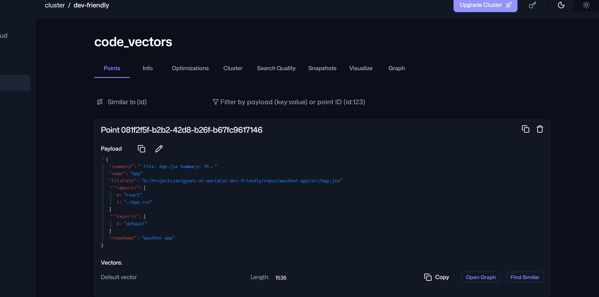
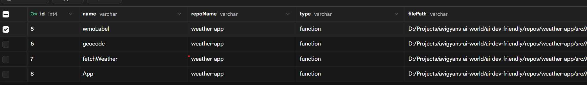

- Semantic Embedding
- Dependency Traversal
- Postgres integration
- Vector DB integration
- Hybrid Retrieval
- Incremental Indexing
- git diff awareness
- Patch Generator
- Scoped file modification
- Planning Agent (TODO - with debate planner) for ticket classification, impact module/file prediction
- Coding Agent
- Coverage Agent (TODO)
- Reviewer Agent
- Langgraph Orchastration
- Langsmith Tracing (TODO)
- Feedback Loop (TODO)

RUN THE SYSTEM
Run presetup
npx ts-node .\apps\workers\index.ts

Terminal 1:
npx ts-node packages/queue/src/worker.ts
Terminal 2:
npx ts-node packages/queue/src/enqueue.ts

Start the application and trigger the feature
npx ts-node .\apps\workers\run-codegen.ts

Embeddings
```
{
    "summary": "\n            File: App.jsx\n            Summary: This file has 7898 characters.\n\n            Purpose: \n            import { useCallback, useEffect, useState } from \"react\";\r\nimport \"./App.css\";\r\n\r\nconst GEO_URL = \"https://geocoding-api.open-meteo.com/v1/search\";\r\nconst WEATHER_URL = \"https://api.open-meteo.com/v1/forecast\";\r\n        ",
    "name": "App",
    "filePath": "D:/Projects/avigyans-ai-world/ai-dev-friendly/repos/weather-app/src/App.jsx",
    "imports": [
        "react",
        "./App.css"
    ],
    "exports": [
        "default"
    ],
    "repoName": "weather-app"
}
```


Psql data
```
[
    {
        "idx": 0,
        "id": 5,
        "name": "wmoLabel",
        "repoName": "weather-app",
        "type": "function",
        "filePath": "D:/Projects/avigyans-ai-world/ai-dev-friendly/repos/weather-app/src/App.jsx",
        "summary": "\n            File: App.jsx\n            Summary: This file has 7898 characters.\n\n            Purpose: \n            import { useCallback, useEffect, useState } from \"react\";\r\nimport \"./App.css\";\r\n\r\nconst GEO_URL = \"https://geocoding-api.open-meteo.com/v1/search\";\r\nconst WEATHER_URL = \"https://api.open-meteo.com/v1/forecast\";\r\n        ",
        "imports": "react,./App.css",
        "exports": "default",
        "methods": null,
        "vectorId": "be041ae7-d829-4371-beda-1cc90a8a566c"
    }
]
```


TICKET
Title:
Change theme to "dark"

Description:
The current theme of the application is light, which can cause eye strain for users who prefer a darker interface. Implementing a dark theme will enhance user experience and provide an alternative visual option.

Acceptance Criteria:
1. A toggle switch is added to the user interface that allows users to switch between light and dark themes.
2. The dark theme should have a consistent color scheme that is easy on the eyes, with appropriate contrast for readability.


MAJOR REQUIRED IMPROVEMENTS

1. The Missing Feedback Loop (The "Self-Healing" Loop)
Right now, your code runs a validation check on Step 5 (AST Validation) and Step 6 (Lint + Typecheck). If it fails, your code throws a fatal error: throw new Error("Lint + Typecheck failed...").

The Enhancement: AI agents rarely write perfect code on the first attempt. Instead of crashing, your workflow should pipe the linter/compiler errors back to the CodingAgent or OperationGraphExecutor along with the current file contents to auto-fix the compilation error.

Give the agent 3 to 5 "healing iterations" before choosing to throw a failure.

2. Context Isolation & Shared Memory
You are passing components across multiple boundaries manually (ticketDescription, context, operations). As your system grows to support test generation or breaking changes, these method signatures will become massive and messy.

The Enhancement: Implement a Stateful Workflow Context or blackboard architecture. Create a lightweight transaction object that tracks the current state of the ticket, the modified files, test execution metrics, lint strings, and past attempts.

3. Step 1 and Step 2 Dependency Flaw
In your execution sequence:

Step 1: The PlannerAgent creates a plan without knowing anything about the codebase state (its retrievalResults parameter is passed as undefined).

Step 3: The RetrievalEngine fetches codebase files after the plan is already set.

The Enhancement: Flip this order or create a two-stage routing mechanism. The planner cannot create an accurate roadmap without evaluating what code patterns actually exist in the target domain first.

4. Hardcoded Git Parameters
In Step 9 and Step 10, you have string boundaries like "automated-patch-branch" and "repo-slug" hardcoded. If two workflows run at the same time on different tickets, they will collide on the exact same remote branch, creating severe race conditions.

5. Deterministic Guardrails: Ensuring LLM output ranges (like structural patches) are validated before being applied to disk.

6. Token & Budget Management: Optimizing how files are read and injected into the context window to prevent massive API bills.

7. Resiliency & Self-Healing: Designing programmatic retry handlers for common code compilation problems.